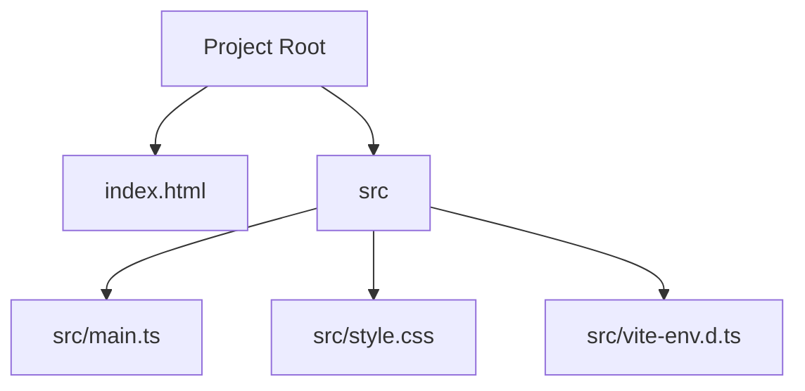
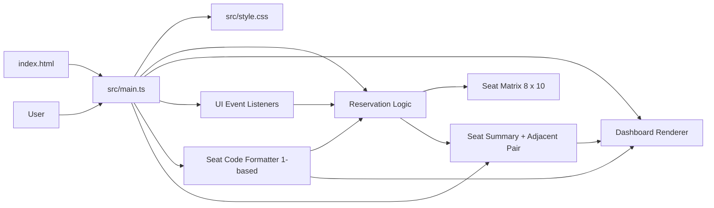
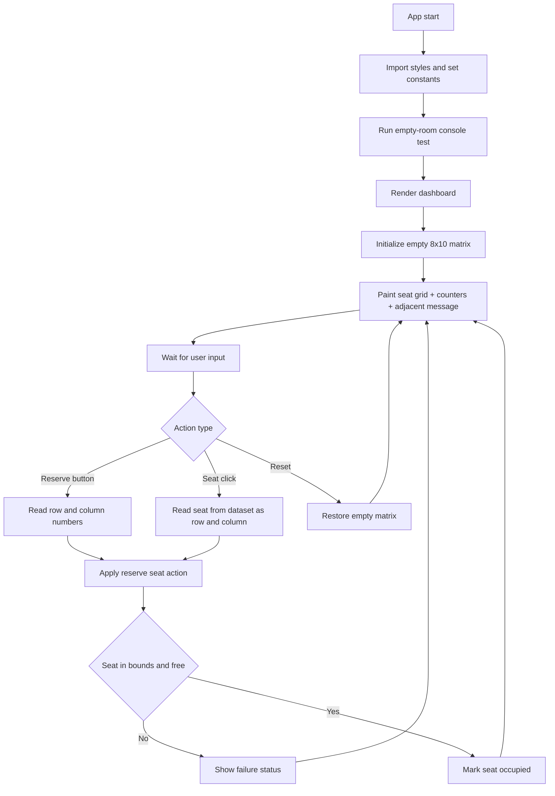

# Cinema Seat Reservation Technical Diagram

This document explains the project from three angles:
1. Relevant file structure
2. Main components
3. Runtime data flow

## 1) Relevant File Structure Diagram

## 2) Main Components Diagram

## 3) Runtime Flow Diagram

